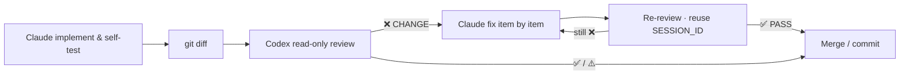

<div align="center">

# codex-mcp-cyber

**Claude writes · Codex reviews (read-only)**

Review → fix → re-review until pass.

<br/>

[](LICENSE)
[](https://www.python.org/)
[](https://modelcontextprotocol.io/)
[](#)

<br/>

[中文文档](README.md)
&nbsp;·&nbsp;
[Quick start](#-quick-start)
&nbsp;·&nbsp;
[Workflow](#-workflow)
&nbsp;·&nbsp;
[Tool](#️-tool-codex)
&nbsp;·&nbsp;
[Install](#-install)

</div>

---

## Why it exists

| | Role | Boundary |
|:----:|:-----|:---------|
| **Claude** | Scope · implement · self-test · fix from review | Engineering owner |
| **Codex** | Independent code review → ✅ / ⚠️ / ❌ | **Review only** (`read-only`) |



> Re-review **must** reuse the same `SESSION_ID`. Max **3** rounds per change, then human.

### Two pieces

| Piece | Role | Install |
|:------|:-----|:--------|
| 🔌 **Plugin** `codex-mcp-cyber@zerostarlet` | `cc-review` skill (the loop) | Claude Code plugin |
| 🧰 **MCP** `codex-mcp-cyber` | `codex` tool (local Codex CLI) | setup / `claude mcp add` |

Also need **Codex CLI** on the machine:

```bash
npm i -g @openai/codex && codex login
```

---

## 🚀 Quick start

### ① Install the skill plugin

```bash
claude plugin marketplace add ZeroStarlet/codex-mcp-cyber
claude plugin install codex-mcp-cyber@zerostarlet
```

<details>
<summary><b>Plugin from a local checkout</b></summary>

```bash
claude plugin marketplace add /path/to/codex-mcp-cyber
claude plugin install codex-mcp-cyber@zerostarlet
```

</details>

### ② Install the MCP server

<table>
<tr>
<td width="50%">

**Windows**

```powershell
git clone https://github.com/ZeroStarlet/codex-mcp-cyber.git
cd codex-mcp-cyber
.\setup.bat
```

</td>
<td width="50%">

**macOS / Linux**

```bash
git clone https://github.com/ZeroStarlet/codex-mcp-cyber.git
cd codex-mcp-cyber
chmod +x setup.sh && ./setup.sh
```

</td>
</tr>
</table>

### ③ Verify

1. Restart **Claude Code**
2. `claude mcp list` → `codex-mcp-cyber`
3. Skills list → **`cc-review`**

---

## 📋 Workflow

Prefer the plugin skill **`cc-review`**:

| Step | Action |
|:----:|:-------|
| **1** | Claude scopes, implements, self-tests |
| **2** | `git diff --no-color`; build PROMPT from the [checklist](skills/cc-review/review-checklist.md) |
| **3** | Call `codex` · `sandbox=read-only` · first review `SESSION_ID=""` |
| **4** | Codex → ✅ pass · ⚠️ non-blocking · ❌ must-fix |
| **5** | ❌ → fix item by item → **re-review reuses `SESSION_ID`** → max 3 rounds |
| **6** | ✅ → merge / commit |

Full rules (including forced review): [`skills/cc-review/SKILL.md`](skills/cc-review/SKILL.md)

---

## 🛠️ Tool `codex`

Runs local Codex CLI; **read-only by default — keep it that way for review**.

### Parameters

| Param | Type | Req | Default | Notes |
|:------|:-----|:--:|:--------|:------|
| `PROMPT` | string | ✅ | — | Must include **diff + full checklist** |
| `cd` | string | ✅ | — | Workdir **bare path** (no quotes) |
| `sandbox` | string | | `read-only` | Must stay read-only for review |
| `SESSION_ID` | string | | `""` | Empty first; reuse on re-review |
| `timeout` | int | | `300` | Idle timeout (seconds) |
| `max_duration` | int | | `1800` | Hard wall clock (seconds) |
| `max_retries` | int | | `1` | Tool-level auto retry |

### Response

| Success | Failure |
|:--------|:--------|
| `success` · `SESSION_ID` · `result` | `error` · `error_kind` · `error_detail` |

Common `error_kind` values: `auth_required` · `invalid_path` · `command_not_found` · `timeout` / `idle_timeout` · `upstream_error`

Full contract → [`codex-guide.md`](skills/cc-review/codex-guide.md)

> **Windows**  
> Do not wrap `cd` in literal quotes. For non-ASCII (e.g. Chinese) workdirs, the MCP may create an ASCII directory junction to reduce Codex-internal `os error 123`.

---

## 📦 Install

### Prerequisites

| Dep | Notes |
|:----|:------|
| Python | **3.12+** |
| uv | [astral.sh/uv](https://github.com/astral-sh/uv) |
| Claude Code CLI | `npm i -g @anthropic-ai/claude-code` |
| Codex CLI | `npm i -g @openai/codex` → `codex login` |

<details>
<summary><b>Manual MCP install (remote / local dev)</b></summary>

```bash
git clone https://github.com/ZeroStarlet/codex-mcp-cyber.git
cd codex-mcp-cyber
uv sync

# remote (tracks latest; --refresh matches the setup scripts, avoids stale uvx cache)
claude mcp add codex-mcp-cyber --scope user --transport stdio -- \
  uvx --refresh --from git+https://github.com/ZeroStarlet/codex-mcp-cyber.git codex-mcp-cyber

# local development
claude mcp add codex-mcp-cyber --scope user --transport stdio -- \
  uv run --directory . codex-mcp-cyber
```

</details>

<details>
<summary><b>Uninstall</b></summary>

| Piece | Command |
|:------|:--------|
| MCP · Windows | `.\uninstall.bat` |
| MCP · Unix | `./uninstall.sh` |
| MCP · manual | `claude mcp remove codex-mcp-cyber --scope user` |
| Plugin | `claude plugin uninstall codex-mcp-cyber@zerostarlet` |

Skills ship **only via the plugin** — don’t copy into `~/.claude/skills/cc-review` (duplicates the plugin).

</details>

---

## 🧑‍💻 Development

```bash
git clone https://github.com/ZeroStarlet/codex-mcp-cyber.git
cd codex-mcp-cyber
uv sync
uv run codex-mcp-cyber
```

| Doc | Content |
|:----|:--------|
| [`CONTEXT.md`](CONTEXT.md) | Domain language |
| [`skills/cc-review/`](skills/cc-review/) | Skill sources |

---

<div align="center">

### References

[Claude Code](https://docs.anthropic.com/en/docs/claude-code)
&nbsp;·&nbsp;
[Codex CLI](https://developers.openai.com/codex/quickstart)
&nbsp;·&nbsp;
[FastMCP](https://github.com/jlowin/fastmcp)

<br/>

**MIT License**

</div>
